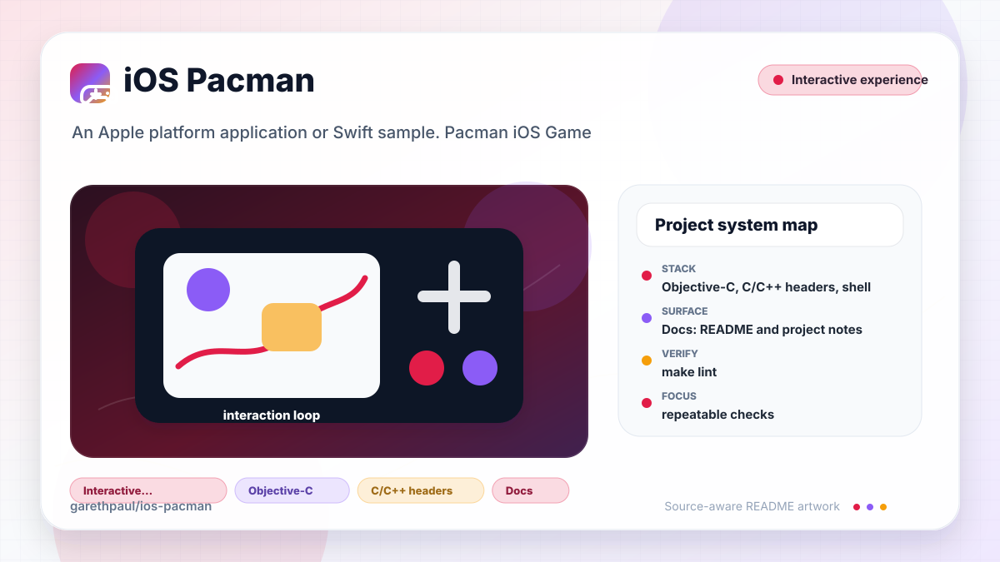

# ios-pacman

<!-- README-OVERVIEW-IMAGE -->


## Overview

`garethpaul/ios-pacman` is an Apple platform application or Swift sample. Pacman iOS Game

This README is based on the checked-in source, manifests, scripts, and repository metadata on the `master` branch. The project language mix found during review was: Objective-C (3), C/C++ headers (2), shell (1).

## Repository Contents

- `CHANGES.md` - concise history of maintenance changes
- `Makefile` - local verification entry point
- `README.md` - project overview and local usage notes
- `build.sh`
- `Maze` - source or example code
- `Maze.xcodeproj` - Xcode project file
- `SECURITY.md` - security reporting and disclosure guidance
- `scripts/check-baseline.py` - static Objective-C/Xcode project verifier
- `VISION.md` - project direction and maintenance guardrails

Additional scan context:

- Source directories: Maze
- Dependency and build manifests: none detected
- Entry points or build surfaces: `make check`, build.sh, Maze.xcodeproj
- Test-looking files: no obvious test files detected

## Getting Started

### Prerequisites

- Git
- macOS with Xcode for building Apple platform projects
- Python 3 for local static verification on non-macOS hosts

### Setup

```bash
git clone https://github.com/garethpaul/ios-pacman.git
cd ios-pacman
make lint
make test
make build
make check
```

The checked-in project has no external dependency manifest. Use Xcode for full builds and `make check` for static verification on hosts without Xcode.

## Running or Using the Project

- Open `Maze.xcodeproj` in Xcode, choose the app or sample scheme, and run it on the matching simulator/device.
- Run `./build.sh` when the required platform toolchain is installed. On hosts without Xcode, the script exits cleanly after reporting that the Xcode build was skipped.
- This is a local game sample with XIB-wired image assets and CoreMotion movement. Non-finite motion samples are rejected before each valid accelerometer sample is assigned and integrated together on the main thread. Gameplay updates clamp the frame time delta before applying accelerometer velocity, resolve boundary and wall constraints before evaluating the corrected collision frame, stop outcome checks after a win, gate collision alerts while visible, and reset the frame clock after alerts. Do not add accounts, analytics, persistence, upload, or network behavior without a dedicated design and security review.

## Testing and Verification

Run the local static baseline:

```bash
make lint
make test
make build
make check
```

The `lint`, `test`, and `build` targets intentionally alias the static baseline
on hosts without the legacy Xcode toolchain, so the standard local gate commands
stay available while preserving the single source of truth.

The baseline runs `scripts/check-baseline.py`, validates POSIX shell syntax for `build.sh`, parses plist/XIB/scheme XML, checks PNG resources, verifies Xcode project references, checks corrected collision ordering and candidate-frame use, accelerometer lifecycle and main-thread handoff, collision alert gating, failure velocity reset behavior, previous position initialization, win completion update guards, alert pause behavior, alert frame clock reset behavior, frame time delta clamping, and weak callback capture guardrails, and guards against debug logging, network, analytics, upload, or persistence behavior.

Pinned `macos-15` CI runs `make check` and compiles the unsigned app for a
generic iOS simulator. It does not exercise accelerometer input, alerts,
rendering, or gameplay.

GitHub Actions runs the same `make check` static baseline with Python 3.12 for
pushes and pull requests.

For full legacy verification on macOS, run `./build.sh` or use Xcode's build/test action with the appropriate scheme and destination.

When the required SDK or runtime is unavailable, use static checks and source review first, then verify on a machine that has the matching platform toolchain.

## Configuration and Secrets

- No required secret or credential file was identified in the repository scan. If you add integrations later, keep secrets out of git.

## Security and Privacy Notes

- Review changes touching network requests, sockets, or service endpoints; examples from the scan include Maze/Maze-Info.plist.
- Review changes touching file, media, JSON, XML, CSV, OCR, or data parsing; examples from the scan include Maze/APPViewController.m, Maze/Maze-Info.plist.
- Resource changes should keep image files, XIB outlets, screenshot, and Xcode project references aligned.
- Accelerometer callbacks should not strongly retain the controller; non-finite motion samples should be rejected and valid updates should remain bounded to the live game screen.
- `build.sh` should stay valid for `/bin/sh` because CI and local shells may not invoke bash.

## Maintenance Notes

- This looks like an Apple platform project or sample. Xcode, Swift, CocoaPods, and deployment target versions may need to match the original project era.
- See `SECURITY.md` for vulnerability reporting and safe research guidance.
- See `VISION.md` for project direction and contribution guardrails.
- See `docs/plans/2026-06-09-alert-update-pause.md` for the alert pause guardrail.
- See `docs/plans/2026-06-09-alert-frame-clock-reset.md` for the alert frame clock reset guardrail.
- See `docs/plans/2026-06-09-failure-velocity-reset.md` for the failure velocity reset guardrail.
- See `docs/plans/2026-06-09-win-completion-update-guard.md` for the win completion update guardrail.
- See `docs/plans/2026-06-10-previous-point-initialization.md` for the previous position initialization guardrail.
- See `docs/plans/2026-06-13-nonfinite-motion-sample-guard.md` for the sensor
  value guardrail.
- See `docs/plans/2026-06-10-ci-baseline.md` for the GitHub Actions static
  baseline.
- See `docs/plans/2026-06-09-make-gate-aliases.md` for the local gate alias guardrail.
- Run `make lint`, `make test`, `make build`, and `make check` before pushing changes to Objective-C sources, plist/XIB files, image assets, Xcode metadata, `build.sh`, or gameplay/security documentation.

## Contributing

Keep changes small and tied to the project that is already present in this repository. For code changes, document the toolchain used, avoid committing generated dependency directories or local configuration, and update this README when setup or verification steps change.
